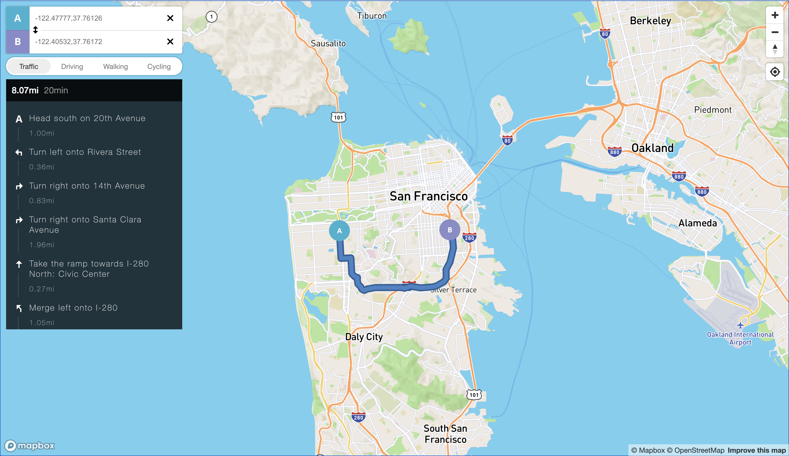

# googleMap-clone-doc-githubio

  

  
  

  -----------------------------------------------------------------

## Introduction:
- Deploy github URL:[https://donghaowu.github.io/googleMap-clone-doc-githubio](https://donghaowu.github.io/googleMap-clone-doc-githubio)

- This is a google map clone application from youtube.

- Youtube URL:[https://www.youtube.com/watch?v=OySigNMXOZU](https://www.youtube.com/watch?v=OySigNMXOZU)

## Mapbox documentation:

- [Mapbox documentation website](https://docs.mapbox.com/)
- [Mapbox GL JS](https://docs.mapbox.com/mapbox-gl-js/api/)
- [Markers and controls](https://docs.mapbox.com/mapbox-gl-js/api/markers/)
- [Display driving directions](https://docs.mapbox.com/mapbox-gl-js/example/mapbox-gl-directions/)

- [Mapbox examples](https://docs.mapbox.com/mapbox-gl-js/example/):gem:

- If you have turned off location in your device and get a blank page like this, select a location to overwrite your current location then refresh the page:

  - Back to [Front end tools](https://github.com/DonghaoWu/Frontend-tools-demo).