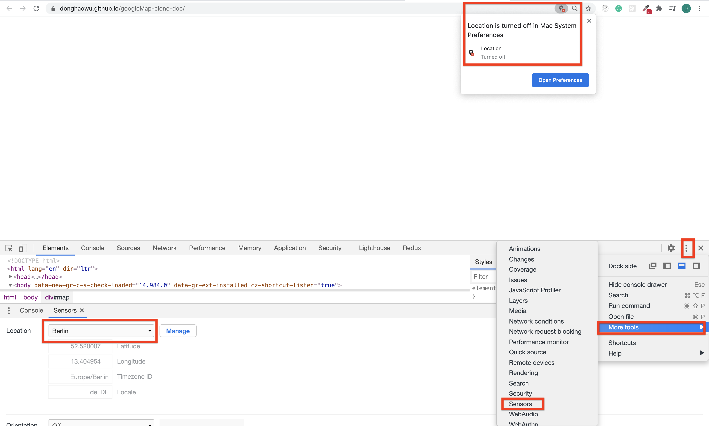

# googleMap-clone-doc

## Introduction:
- Deploy github URL:[https://donghaowu.github.io/googleMap-clone-doc/](https://donghaowu.github.io/googleMap-clone-doc/)

- This is a google map clone application from youtube.

- Youtube URL:[https://www.youtube.com/watch?v=OySigNMXOZU](https://www.youtube.com/watch?v=OySigNMXOZU)

## Mapbox documentation:

- [Mapbox documentation website](https://docs.mapbox.com/)
- [Mapbox GL JS](https://docs.mapbox.com/mapbox-gl-js/api/)
- [Markers and controls](https://docs.mapbox.com/mapbox-gl-js/api/markers/)
- [Display driving directions](https://docs.mapbox.com/mapbox-gl-js/example/mapbox-gl-directions/)

- :gem:[Mapbox examples](https://docs.mapbox.com/mapbox-gl-js/example/)

- If you have turned off location in your device but want to test the app in a fake location, do it like this:

  

  
  

  -----------------------------------------------------------------